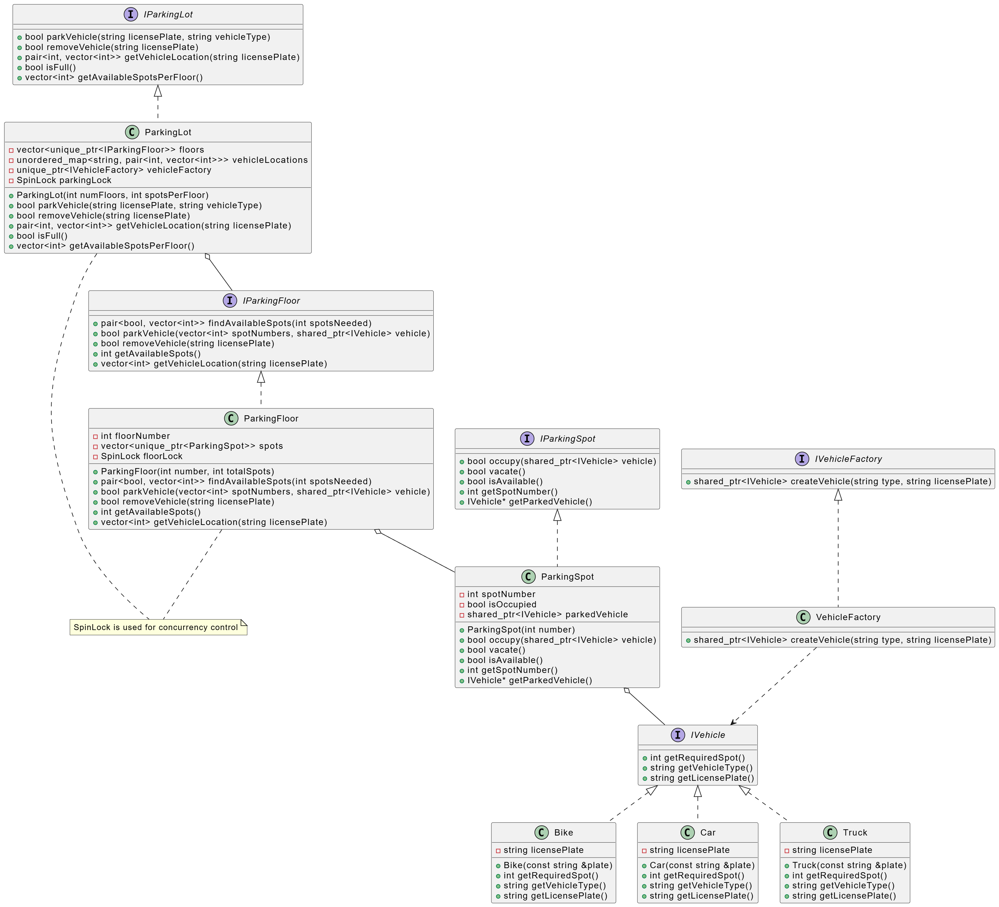

# Parking Lot System

## Overview
The Parking Lot System is an object-oriented parking management solution implemented in C++. It supports multiple floors, different vehicle types, and operations like parking, removing, and querying available spots. The system is designed for concurrency safety using spinlocks.

## Running the Project

### Compilation and Execution
To compile and run the project, use the following commands:

#### Windows (Using MinGW)
```sh
g++ main.cpp -o a.exe
./a.exe
```

#### Linux/macOS
```sh
g++ main.cpp -o a.out
./a.out
```

## Project Structure
```
📂 Parking_Lot
├── 📂 include
│   ├── 📂 interface
│   │   ├── IVehicle.h
│   │   ├── IVehicleFactory.h
│   │   ├── IParkingSpot.h
│   │   ├── IParkingLot.h
│   │   ├── IParkingFloor.h
├── 📂 src
│   ├── 📂 factories
│   │   ├── VehicleFactory.h
│   ├── 📂 parking
│   │   ├── floor
│   │   │   ├── ParkingFloor.h
│   │   ├── lot
│   │   │   ├── ParkingLot.h
│   │   ├── spot
│   │   │   ├── ParkingSpot.h
│   ├── 📂 vehicles
│   │   ├── Bike.h
│   │   ├── Car.h
│   │   ├── Truck.h
├── 📂 utils
│   ├── SpinLock.h
├── main.cpp
├── a.exe (Generated after compilation)
├── UML_ParkingLot.png
```

### Interfaces (Located in `include/interface/`)
- **IVehicle.h**: Abstract interface for different vehicle types.
- **IVehicleFactory.h**: Interface for vehicle factory logic.
- **IParkingSpot.h**: Interface for parking spots.
- **IParkingLot.h**: Defines core functionalities of the parking lot.
- **IParkingFloor.h**: Interface for parking floor management.

### Concrete Implementations (Located in `src/`)
- **VehicleFactory.h**: Factory pattern implementation for vehicle creation.
- **ParkingFloor.h**: Manages parking floors.
- **ParkingLot.h**: Implements the parking lot logic.
- **ParkingSpot.h**: Handles parking spot operations.
- **Bike.h, Car.h, Truck.h**: Implementations for different vehicle types.

## User Interaction
Users must interact with the system via the terminal. The available options are:
```cpp
cout << "\n========== PARKING LOT SYSTEM ==========\n";
cout << "Press 1 to park a vehicle" << endl;
cout << "Press 2 to remove a vehicle" << endl;
cout << "Press 3 to get vehicle location" << endl;
cout << "Press 4 to show available spots per floor" << endl;
cout << "Press 5 to check if parking lot is full" << endl;
cout << "Press 6 to exit" << endl;
cout << "Enter your choice: ";
```


## Additional Resources
For a better understanding of the system, refer to the UML diagram:



---
**Author:** Kushal Shekhawat

